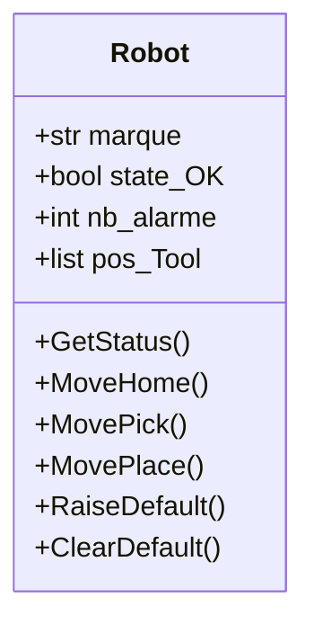

# Cours_OOP

## Tutorial

[python](https://openclassrooms.com/fr/courses/7150616-apprenez-la-programmation-orientee-objet-avec-python)

[cpp](https://openclassrooms.com/fr/courses/7137751-programmez-en-oriente-objet-avec-c)

[markdown](https://www.markdownguide.org/)

[mermaid](https://mermaid.live/edit)

## Class

marque = FANUC
